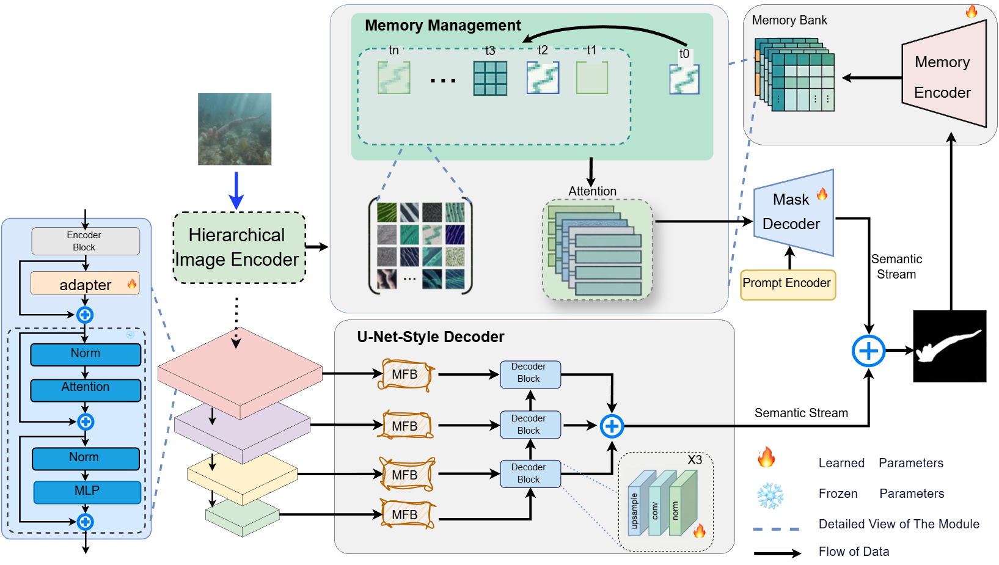

# Enhancing Segmentation Accuracy: MMSAM2 for Medical, Marine, and Camouflaged Object Detection

> **Note:** This code is directly related to the manuscript currently submitted to *The Visual Computer*. If you find this work useful, please verify the status of the manuscript and cite it accordingly.

## Introduction



This repository contains the official implementation of **MMSAM2**, a parameter-efficient framework adapting a frozen SAM2 backbone for specialized segmentation tasks including **Medical Imaging**, **Marine Ecological Monitoring**, and **Camouflaged Object Detection**.

MMSAM2 addresses the challenges of low-contrast boundaries and domain shifts by integrating:
- **Multi-Field Bottleneck Fusion (MFB)**: Decouples spatial frequencies via factorized large kernels to recover fine-grained details.
- **Quality-aware Dynamic Memory Bank (DMB)**: Retrieves cross-sample prototypes to maintain consistency across diverse scenes.
- **Dual-Path Decoder**: Fuses semantic priors with high-frequency structural cues via parameter-free late fusion.

## Requirements

Please configure the environment as follows:

```shell
conda create -n py12 python=3.12 -y
conda activate py12
conda install nvidia/label/cuda-12.4.0::cuda -y
conda install pytorch==2.5.1 torchvision==0.20.1 torchaudio==2.5.1 pytorch-cuda=12.4 -c pytorch -c nvidia -y

# Install SAM2
pip install -e .

# Install dependencies
pip install opencv-python
pip install pysodmetrics --only-binary=:all: numpy
```

## Prepare Datasets

Please refer to the following repositories and their papers for the detailed configurations of the corresponding datasets.
- Camouflaged Object Detection: [FEDER](https://github.com/ChunmingHe/FEDER)
- Marine Animal Segmentation: [MASNet](https://github.com/zhenqifu/MASNet)
- Polyp Segmentation: [PraNet](https://github.com/DengPingFan/PraNet)

### Dataset Organization
Ensure your datasets are organized in the `data/` directory. Each domain (Camouflaged, Marine, Polyp, Salient) should have a `train` folder (merged training set) and a `valid` folder (separate test datasets).

```text
data/
├── Camouflaged/
│   ├── train/
│   │   ├── images/
│   │   └── masks/
│   └── valid/
│       ├── CAMO/
│       │   ├── images/
│       │   └── masks/
│       ├── CHAMELEON/
│       └── COD10K/
├── Marine/
│   ├── train/
│   │   ├── images/
│   │   └── masks/
│   └── valid/
│       ├── RMAS/
│       └── MAS3K/
├── Polyp/
    ├── train/
    │   ├── images/
    │   └── masks/
    └── valid/
        ├── CVC-300/
        ├── CVC-ClinicDB/
        └── ...
```

### Logging & Checkpoints
The training logs and model checkpoints are automatically saved in the `logs/` directory, organized by experiment name and timestamp:

```text
logs/
└── <Experiment_Name>/          # e.g., Polyp, Marine
    └── <YYYY_MM_DD_HHMMSS>/    # Timestamp of the training run
        ├── checkpoints/        # Saved model weights (last.pth, best.pth, etc.)
        └── logs/               # Tensorboard logs or text logs
```

## Training

1.  **Download Backbone**: Download the pre-trained `sam2_hiera_large.pt` (renamed to `sam2.pt`) and place it in the root directory. You can download it from [here](https://dl.fbaipublicfiles.com/segment_anything_2/072824/sam2_hiera_large.pt).

2.  **Run Training**: Use `train.py` in the root directory.

```shell
# Example: Training on Polyp dataset
python train.py \
  --exp_name Polyp \
  --data_path ./data/Polyp \
  --valid_list CVC-300 CVC-ClinicDB CVC-ColonDB ETIS-LaribPolypDB Kvasir \
  --hiera_path ./sam2.pt \
  --epoch 300 \
  --batch_size 12
```

Arguments:
*   `--exp_name`: Experiment name (used for logging and saving checkpoints).
*   `--data_path`: Path to the specific dataset root.
*   `--valid_list`: List of sub-datasets to validate against.

## Testing & Evaluation

Evaluation consists of two steps: generating predictions and calculating metrics. Scripts are located in the `eval/` folder, but should be run from the project root to resolve imports correctly.

### 1. Generate Predictions
Use `eval/test.py` to generate masks.

```shell
# Example: Testing on RMAS dataset
python eval/test.py \
  --checkpoint "logs/Marine/best.pth" \
  --test_image_path "./data/Marine/valid/RMAS/images/" \
  --test_gt_path "./data/Marine/valid/RMAS/masks/" \
  --save_path "./data/Marine/valid/RMAS/preds/"
```

### 2. Calculate Metrics
Use `eval.py` to calculate SOD metrics (Dice, IoU, etc.).

```shell
# Example: Evaluation for RMAS
python eval.py \
  --dataset_name "RMAS" \
  --pred_path "./data/Marine/valid/RMAS/preds/" \
  --gt_path "./data/Marine/valid/RMAS/masks/"
```

### Automated Scripts
You can refer to the shell scripts in `eval/` (e.g., [`eval/marine_auto.sh`](eval/marine_auto.sh)) for batch processing logic, but ensure paths to `test.py` and `eval.py` are correct relative to your working directory.

## Other Interesting Works
If you are interested in designing SAM2-based methods, the following papers may be helpful:

[2025] [Boundary-guided multi-scale refinement network for camouflaged object detection](https://doi.org/10.1007/s00371-024-03786-5)

[2025] [MCGFF-Net: a multi-scale context-aware and global feature fusion network for enhanced polyp and skin lesion segmentation](https://doi.org/10.1007/s00371-024-03720-9)

[2025.02] [Fine-Tuning SAM2 for Generalizable Polyp Segmentation with a Channel Attention-Enhanced Decoder](https://ojs.sgsci.org/journals/amr/article/view/311)

[2025.02] [FE-UNet: Frequency Domain Enhanced U-Net with Segment Anything Capability for Versatile Image Segmentation](https://arxiv.org/abs/2502.03829)

[2025.01] [Progressive Self-Prompting Segment Anything Model for Salient Object Detection in Optical Remote Sensing Images](https://doi.org/10.3390/rs17020342)


## Citation
If you find our work useful in your research, please consider citing:

```bibtex
@article{MMSAM2,
  title={Enhancing Segmentation Accuracy: MMSAM2 for Medical, Marine, and Camouflaged Object Detection},
  journal={The Visual Computer},
  year={2025}
}
```

## Acknowledgement
[segment anything 2](https://github.com/facebookresearch/segment-anything-2)
