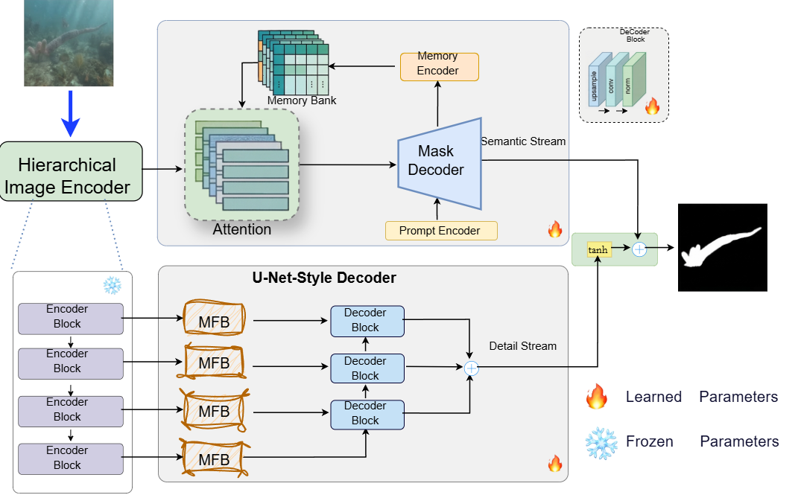

# DPSAM2: Memory-Guided Dual-Path Adaptation of SAM2 for Boundary-Aware Low-Contrast Segmentation

[](https://doi.org/10.5281/zenodo.20439347)

> **Note:** This code is directly related to the manuscript currently submitted to *The Visual Computer*. If you find this work useful, please verify the status of the manuscript and cite it accordingly.

## Introduction



This repository contains the implementation and reproducibility notes for **DPSAM2**, a frozen-backbone SAM2 adaptation framework for boundary-aware segmentation in medical endoscopy, marine animal segmentation, and camouflaged object detection. The core implementation file is still named `mmsam2.py` for compatibility with earlier experiments.

DPSAM2 is designed for images where object boundaries are faint, small targets are easy to miss, or the test domain differs from the pretraining distribution. It combines:
- **Multi-Field Bottleneck Fusion (MFB)**: extracts local boundary cues and broader context with factorized convolutional branches.
- **Dynamic Memory Bank (DMB)**: stores compact feature-level records generated from training images and retrieves selected records during prompt-free inference.
- **Dual-Path Decoder**: combines a SAM2 semantic stream with a detail stream through late fusion. This term denotes logit-scale alignment for fusion.

The GitHub repository and archived release are part of the scientific contribution. They are intended to let readers inspect the architecture, reproduce the reported training and prompt-free evaluation protocol, and understand the data and model limitations.

## Reproducibility Package

The table below maps the reproducibility materials requested for the manuscript to their location or release convention.

| Material | Location or convention |
| --- | --- |
| Model architecture code | `mmsam2.py`, `sam2/modeling/`, and `sam2/modeling/backbones/MFB.py`. |
| Preprocessing and data loading | `dataset.py`. Training images and masks are resized to `352 x 352`; training uses random horizontal and vertical flips with probability 0.5; evaluation uses resize, tensor conversion, and ImageNet mean/std normalization without random flips. |
| Task and dataset configuration | `train.py` contains `TASK_CONFIGS` for `Polyp`, `Marine` and `Camouflaged`; SAM2 backbone configs are under `sam2/configs/`. CLI arguments can override data roots, validation lists, seeds, prompt type, and checkpoint paths. |
| Train/validation/test splits | The code uses a folder-based split: `data/<Task>/train/` for training images and `data/<Task>/valid/<Dataset>/` for validation or test datasets. Keep sorted per-image manifests with any archived release if a local dataset copy is changed. |
| Random seeds | Use `--seed`. The manuscript reports four-seed results using `42`,`1024`, `2048`, and `3407`. |
| Training script | `train.py`. It trains task-group-specific checkpoints and runs internal validation at `--valid_interval`. |
| Pretrained checkpoints | Place released checkpoints under `checkpoints/` or download them from the linked cloud folder in this README. Checkpoints are large binary files and may be hosted outside GitHub while remaining part of the archived release record. |
| Serialized DMB states | Saved inside each training checkpoint as `memory_bank_state` with memory records, capacity, thresholds, usage counts, timestamps, and current time. |
| Inference and prediction export | Prompt-free validation/test inference is executed by the internal evaluation path in `train.py` with `prompt_mode="none"`. Add `--save_predictions` to save logits, probabilities, and 16-bit probability previews under the run directory. |
| Metric calculation | `train.py` computes Dice, IoU, `S_alpha`, weighted F-measure, enhanced alignment, MAE, Boundary IoU, Boundary F-score, Hausdorff distance, HD95, and normalized surface Dice.
| Main-table reproduction tutorial | See [Reproducing the Main Tables](#reproducing-the-main-tables). |
| Dataset cards | See [Dataset Cards](#dataset-cards). |
| Model card | See [Model Card](#model-card). |

## Project Structure

```text
.
├── mmsam2.py                    # DPSAM2 architecture wrapper and DMB logic
├── train.py                     # Training, checkpointing, internal validation, metrics
├── dataset.py                   # Dataset layout, preprocessing, prompt sampling
├── _utils.py                    # Logging and metric helper initialization
├── scripts/                     # Log parsing, profiling, visualization utilities
├── sam2/                        # SAM2 code and model configuration files
├── checkpoints/                 # Local checkpoint directory, ignored for large files
└── README.md                    # Reproducibility guide, dataset cards, model card
```

## Requirements

Please configure the environment as follows. The reported experiments were run with CUDA-capable NVIDIA GPUs; other hardware may require changes to batch size or PyTorch/CUDA versions.

```shell
conda create -n py12 python=3.12 -y
conda activate py12
conda install nvidia/label/cuda-12.4.0::cuda -y
conda install conda-forge::cudnn -y
conda install pytorch==2.5.1 torchvision==0.20.1 torchaudio==2.5.1 pytorch-cuda=12.4 -c pytorch -c nvidia -y

# Install SAM2
git clone https://github.com/facebookresearch/sam2.git && cd sam2
pip install -e .

# Install other dependencies
pip install opencv-python
pip install pysodmetrics --only-binary=:all: numpy
```

## Prepare Datasets

This repository does not relicense or redistribute benchmark images. Download each dataset from its official source or from the dataset links used by the cited benchmark repositories, then place images and masks in the structure below.

- Camouflaged Object Detection: [FEDER](https://github.com/ChunmingHe/FEDER)
- Marine Animal Segmentation: [MASNet](https://github.com/zhenqifu/MASNet)
- Polyp Segmentation: [PraNet](https://github.com/DengPingFan/PraNet)

### Dataset Organization
Ensure your datasets are organized in the `data/` directory. Each task group should have a `train` folder for model fitting and a `valid` folder containing the named validation or test datasets used for reporting. The loader sorts image and mask filenames before pairing them, so filenames should match across `images/` and `masks/`.

```text
data/
├── Camouflaged/
│   ├── train/
│   │   ├── images/
│   │   └── masks/
│   └── valid/
│       ├── CAMO/
│       │   ├── images/
│       │   └── masks/
│       ├── CHAMELEON/
│       └── COD10K/
```

### Logging & Checkpoints
The training logs and model checkpoints are automatically saved in the `logs/` directory, organized by experiment name and timestamp:

```text
logs/
└── <Experiment_Name>/          # e.g., Polyp, Marine
    └── <YYYY_MM_DD_HHMMSS>/    # Timestamp of the training run
        ├── checkpoints/        # Saved model weights (last.pth, best.pth, etc.)
        └── logs/               # Tensorboard logs or text logs
```

## Training

1.  **Download Backbone**: Download the pre-trained `sam2_hiera_large.pt` (renamed to `sam2.pt`) and place it in the root directory. You can download it from [here](https://dl.fbaipublicfiles.com/segment_anything_2/072824/sam2_hiera_large.pt).

2.  **Run Training**: Use `train.py` in the root directory. When training from scratch, pass `--resume_checkpoint ""` to avoid loading a local checkpoint.

```shell
# Example: training on the Polyp task group from scratch
python train.py \
  --task Polyp \
  --exp_name Polyp_seed1024 \
  --data_path ./data/Polyp \
  --hiera_path ./sam2.pt \
  --resume_checkpoint "" \
  --epoch 300 \
  --batch_size 5 \
  --seed 1024 \
  --save_predictions
```

Arguments:
* `--task`: Task group. Supported values are `Polyp`, `Marine`, `Camouflaged`, and `Salient`.
* `--exp_name`: Experiment name used for logs, checkpoints, and saved predictions.
* `--data_path`: Path to the task-specific dataset root.
* `--valid_list`: Optional list of validation or test subsets. If omitted, `TASK_CONFIGS` in `train.py` is used.
* `--hiera_path`: Path to the SAM2 backbone checkpoint.
* `--resume_checkpoint`: Path to a DPSAM2 checkpoint. Use an empty string for training from scratch.
* `--seed`: Random seed for reproducible runs.
* `--save_predictions`: Save probability maps and logits during internal validation.

## Testing & Evaluation

Pretrained DPSAM2 checkpoints are available from [Google Drive](https://drive.google.com/drive/folders/1xJN-TZOs0UT3LwM_rw4OMOD9VXo15oNz?usp=drive_link). Store downloaded files under `checkpoints/`.

Use `evaluate_checkpoint.py` to evaluate a trained checkpoint independently of the training loop. The script builds the model, restores the model weights and serialized DMB state from `--checkpoint`, switches the model to evaluation mode, and runs inference without creating an optimizer or scheduler. No training update is performed, and no separate SAM2 backbone checkpoint is required. Evaluation currently requires a CUDA-capable GPU and uses full FP32 computation with autocast and TF32 disabled.

```shell
# Example: evaluate a Polyp checkpoint with the task's default validation subsets
python evaluate_checkpoint.py \
  --checkpoint ./checkpoints/Polyp.pth \
  --task Polyp \
  --data_path ./data/Polyp
```

`--task` selects the dataset root and validation subsets defined in `TASK_CONFIGS` in `train.py`. Supported values are `Polyp`, `Marine`, `Camouflaged`, and `Salient`. Use `--data_path` when the local dataset root differs from the task default, and use `--valid_list` to evaluate only selected subsets:

```shell
python evaluate_checkpoint.py \
  --checkpoint ./checkpoints/Polyp.pth \
  --task Polyp \
  --data_path ./data/Polyp \
  --valid_list Kvasir ETIS-LaribPolypDB CVC-300 CVC-ClinicDB
```

## Dataset Cards

### Polyp Segmentation

- **Data used:** Public polyp segmentation benchmarks organized into a task-level training folder and named validation/test folders such as CVC-300, CVC-ClinicDB, ETIS-LaribPolypDB, and Kvasir.
- **Intended use:** Research on automatic polyp segmentation under low-contrast boundaries, small lesions, and cross-center appearance changes.
- **Labels:** Binary masks for polyp foreground.
- **License:** Follow the original license and access terms of each dataset. This repository does not change those terms.
- **Known limitations:** Dataset acquisition protocols differ across centers; results should not be interpreted as clinical validation for deployment.
- **Failure modes:** Specular highlights, folds, ambiguous lesion boundaries, and very clear large lesions can reduce or obscure the benefit of memory-guided adaptation.

### Marine Animal Segmentation

- **Data used:** Public marine animal segmentation benchmarks, including MAS3K and RMAS in the reported evaluation.
- **Intended use:** Research on underwater object segmentation with turbidity, color shift, clutter, and scale variation.
- **Labels:** Binary masks for target marine animals.
- **License:** Follow the original dataset licenses and citation requirements.
- **Known limitations:** Underwater image quality varies strongly with lighting, water condition, camera distance, and background clutter.
- **Failure modes:** Background structures with similar color or texture can attract false responses, especially when the target boundary is weak.

### Camouflaged Object Detection

- **Data used:** Public camouflaged object benchmarks such as CAMO, CHAMELEON, COD10K, and NC4K.
- **Intended use:** Research on binary segmentation when foreground and background appearance are similar.
- **Labels:** Binary masks for camouflaged target objects.
- **License:** Follow the original dataset licenses and access terms.
- **Known limitations:** Category diversity and camouflage strength vary across datasets; compact memory records may not represent every rare structure.
- **Failure modes:** Strong background texture, patch-level artifacts, or stored memory records that resemble the background more than the target can produce false positives.

## Model Card

- **Model name:** DPSAM2.
- **Base model:** SAM2 Hiera-L backbone loaded from `sam2_hiera_large.pt`; the backbone is kept frozen in the reported protocol.
- **Additional trainable parts:** Low-rank adapters, MFB, semantic attention and decoder components, and the detail stream.
- **Training data:** Task-group-specific training folders for polyp, marine, and camouflaged segmentation. Test images are not used to update model weights or DMB records.
- **Intended use:** Research reproduction and method comparison for binary segmentation under low contrast, boundary ambiguity, and domain shift.
- **Out-of-scope use:** Clinical decision making, safety-critical automation, open-vocabulary generic segmentation, and deployment on private or regulated data without independent validation.
- **Inputs and outputs:** RGB image input; binary foreground probability map and thresholded mask output.
- **Prompt setting:** Training may use prompt dropout. The reported final evaluation is prompt-free.
- **DMB behavior:** DMB records are written during training and serialized in checkpoints. During prompt-free evaluation, the bank is read as a fixed feature-level reference and is not updated with validation or test images.
- **Licenses:** Model weights and code should be used together with the SAM2 license and the licenses of all datasets used to train or evaluate a checkpoint.
- **Known limitations:** The model adds trainable parameters and computational overhead beyond the frozen SAM2 backbone, so resource use should be checked for each deployment setting.
- **Failure modes:** False positives may occur in cluttered low-contrast backgrounds; very small, translucent, truncated, or heavily occluded targets may be missed; DMB retrieval can be less helpful when the nearest stored feature records match the background structure.

## Other Interesting Works
If you are interested in designing SAM2-based methods, the following papers may be helpful:

[2025] [Boundary-guided multi-scale refinement network for camouflaged object detection](https://doi.org/10.1007/s00371-024-03786-5)

[2025] [MCGFF-Net: a multi-scale context-aware and global feature fusion network for enhanced polyp and skin lesion segmentation](https://doi.org/10.1007/s00371-024-03720-9)

[2025.02] [Fine-Tuning SAM2 for Generalizable Polyp Segmentation with a Channel Attention-Enhanced Decoder](https://ojs.sgsci.org/journals/amr/article/view/311)

[2025.02] [FE-UNet: Frequency Domain Enhanced U-Net with Segment Anything Capability for Versatile Image Segmentation](https://arxiv.org/abs/2502.03829)


## Citation
If you find our work useful in your research, please consider citing:

```bibtex
@article{DPSAM2,
  title={DPSAM2: Memory-Guided Dual-Path Adaptation of SAM2 for Boundary-Aware Low-Contrast Segmentation},
  journal={The Visual Computer},
  year={2025}
}
```

## Acknowledgement
[segment anything 2](https://github.com/facebookresearch/segment-anything-2)
